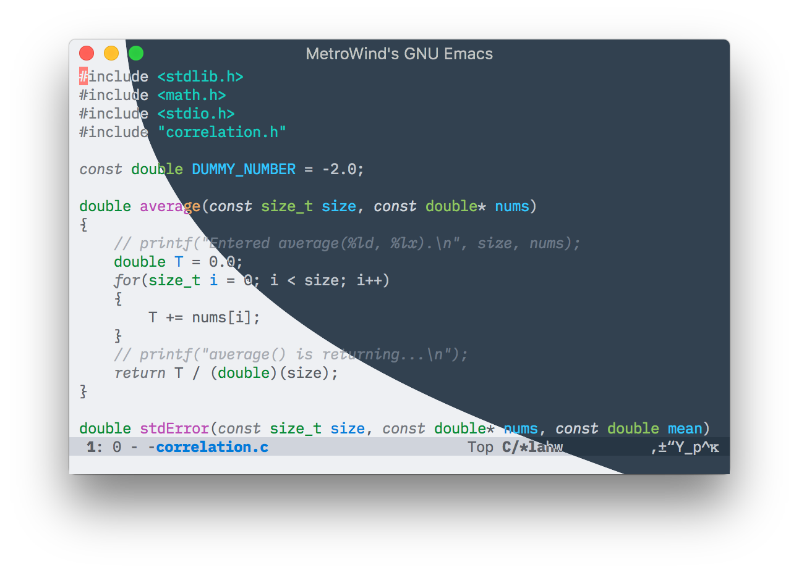

= Lab Theme for Emacs
MetroWind <chris.corsair@gmail.com>

A carefully constructed color theme for max labbiness! The name comes
from the fact that I acquired these colors by fiddling in the LAB
color space.

== Installation

Install `lab-themes` from Melpa, and call `(lab-themes-load-style
'light)` (or `'dark`) to activate the theme. The function
`lab-themes-switch-style` can be used to toggle between light and dark
variant.

If you want to install manually, copy `lab-light-theme.el` and
`lab-dark-theme.el` to somewhere in your `custom-theme-load-path`, and
`(load-theme 'lab-light t)` (or `lab-dark`).

The `other` directory contains the color setting for some other
programs.
